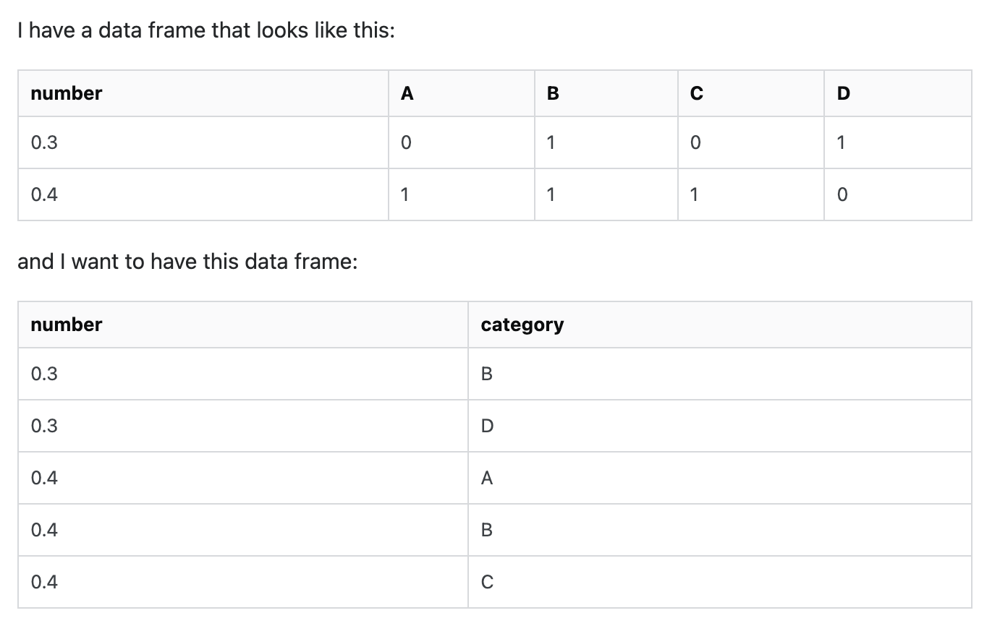
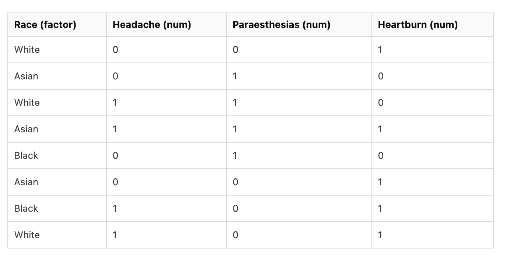
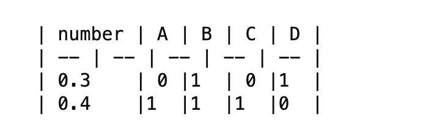

# readSOdata

I do like answering questions on Stack Overflow (SO). It is easier and faster to answer questions when the asker provides data in a reproducible format. However, many questions don't have data in easy to copy manner. 

Here are couple of examples -




and another one




These table look good on SO but they are not easy to copy and use making it difficult to quickly help others. This package aims at solving this problem.


If you click on Edit button on SO in the question these table look like this 



Copy the data as it is and pass it to `readSOData` function. You may need to remove the second empty line  (`| -- | -- | -- | -- | -- |`) before passing the text to the function. 

```
df <- readSOdata::readSOdata('| number | A | B | C | D |
   | 0.3    | 0 |1  | 0 |1  |
   | 0.4    |1  |1  |1  |0  |')
   
df

#   number A B C D
#1    0.3 0 1 0 1
#2    0.4 1 1 1 0


readSOdata::readSOdata('| Race  | Headache | Paraesthesias  | Heartburn 
| White    | 0            | 0 | 1
| Asian   | 0           | 1| 0
| White    | 1           | 1 | 0
| Asian   | 1           | 1 | 1
| Black   | 0            | 1 |0
| Asian   | 0           | 0 |1
| Black    | 1           | 0 |1
| White   | 1           | 0 | 1')

#   Race Headache Paraesthesias Heartburn
#1 White        0             0         1
#2 Asian        0             1         0
#3 White        1             1         0
#4 Asian        1             1         1
#5 Black        0             1         0
#6 Asian        0             0         1
#7 Black        1             0         1
#8 White        1             0         1
```


Function `readSOData` also drops the columns that have all `NA` in them. 

